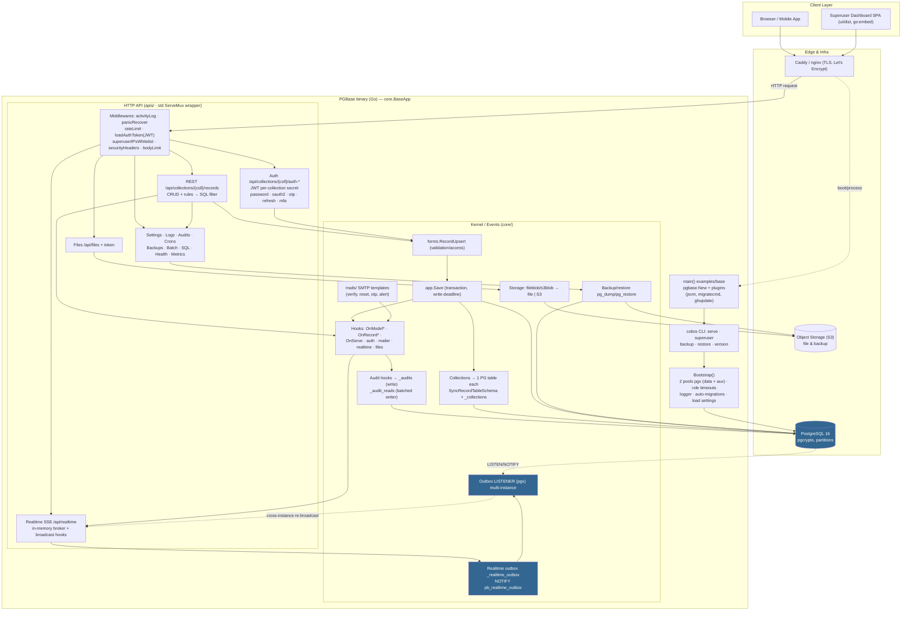

# Architecture (End-to-End)

<DocMeta audience="Contributor" status="stable" verified="v0.5.2" />

> PG-Base is a fork of PocketBase v0.39 that replaces SQLite with **PostgreSQL**.

## Overview

PG-Base is a **PostgreSQL**-powered backend-as-a-service. The runnable entrypoint lives in `examples/base` (the root package is a library). Module: `github.com/arief-fajri/pgbase`.

## Layers

### 1. Entrypoint & CLI (`examples/base`, `pgbase.go`, `cmd/`)

- `main()` (`examples/base/main.go`) creates `pgbase.New()`, registers plugins (jsvm, migratecmd, ghupdate), an `OnServe` hook for static `pb_public`, then calls `app.Start()`.
- `PGBase.Start()` (`pgbase.go:146`) registers 4 Cobra commands: `serve`, `superuser` (upsert/create/update/delete/otp/ips), `backup` (native `pg` or legacy `sqlite`), `restore`.
- `Execute()` runs `Bootstrap()` (skipped for `--help/--version`), executes the root command, waits on SIGINT/SIGTERM, then triggers `OnTerminate` → `ResetBootstrapState()` for graceful shutdown.

### 2. App kernel (`core/`)

`core.BaseApp` (`core/base.go`) is the heart of the app. `Bootstrap()` flow (`base.go:424`):

1. Open **two connection pools to the same PostgreSQL** database: `dataDB` (80 open / 15 idle) and `auxDB` (10/3) via `dbx.Open("pgx", DSN)` (`core/db_connect.go`). DSN and pool sizes come from `PB_POSTGRES_*` env vars.
2. `ensurePostgresRoleTimeouts()` sets `statement_timeout=60s`, `lock_timeout=30s` (PgBouncer-compatible).
3. Init logger → **auto-run system migrations** (`RunSystemMigrations`) → reload cached collections & settings.
4. `auxDB` serves logs (`_logs`) and migration locking; `dataDB` serves app data.

**Event/hook system**: the whole lifecycle is decorated with events (`core/events.go`) — `OnBootstrap/OnServe/OnTerminate`, `OnModel{Create,Update,Delete}*`, `OnRecord*` (incl. request-level), auth, mailer, realtime, files, collections, settings. Audit and realtime plug in via these hooks (`registerBaseHooks` → `registerAuditHooks`, etc.).

### 3. HTTP API (`apis/`)

**Notable fork change**: upstream Echo is replaced by a thin wrapper over Go's std `http.ServeMux` (Go 1.22) in `tools/router`.

- `apis.Serve` (`serve.go:63`) → `RunAllMigrations()` → `NewRouter()`.
- Global middlewares (`apis/base.go:30-36`): `activityLogger` → `panicRecover` → `rateLimit` → `loadAuthToken` (JWT) → `superuserIPsWhitelist` → `securityHeaders` → `BodyLimit` (32 MiB); plus CORS and gzip.
- Route groups: CRUD `/api/collections/{coll}/records`, auth `/auth-*`, `/api/settings`, `/api/logs`, `/api/audits` (fork), `/api/backups`, `/api/crons`, `/api/files`, `/api/batch`, `/api/realtime` (SSE), `/api/health`, `/api/sql` (fork, superuser SQL runner), UI `/_/{path...}`, and Prometheus `/metrics` on a separate listener.
- Admins (`_superusers`) and regular users are **both `Record`s of auth collections** — there are no longer `/api/users` or `/api/admins` groups.

### 4. Request → DB flow

Handler → `e.RequestInfo()` (body/query/auth) → validation via `forms.RecordUpsert` → `app.Save` in a transaction → model hooks (`OnModelAfterCreateSuccess`, etc.) that drive **realtime**, **audit**, and **log**. Access rules (`listRule`/`viewRule`/`createRule`…) are translated into SQL filters. Errors are returned as `*router.ApiError`.

### 5. Dynamic data model

- Collection schemas are stored in the `_collections` table (`fields` JSONB + access rules + options).
- **Each collection maps to a real PostgreSQL table**; schema sync (create/alter/index) runs through `SyncRecordTableSchema` when a collection is created/edited.
- A record is a plain row with a 15-char ID. `_params` stores settings (optional AES encryption via `PB_ENCRYPTION_KEY`), `_migrations` stores migration history. Data and settings no longer live in `pb_data` files.

### 6. Realtime (SSE + multi-instance)

- In-memory broker (`tools/subscriptions`) with `GET /api/realtime` (SSE) and `POST /api/realtime`.
- Create/update/delete broadcasts are driven by hooks and filtered per subscriber using `viewRule`/`listRule`.
- **Fork**: every event is also written to the `_realtime_outbox` table plus `NOTIFY pb_realtime_outbox`; `apis/realtime_outbox_listener.go` opens a dedicated pgx `LISTEN` connection so events **propagate across instances**.

### 7. Audit trail (fork feature)

- `_audits` (create/update/delete changes: diff, snapshot, actor, IP/UA) hooked from `OnRecord*Execute`, written in-transaction guarded by SAVEPOINT.
- `_audit_reads` (view/list access metadata) is enqueued to a **batched writer** (flush 200 rows / 3s / single tx).
- Both are **range-partitioned by month** with a default partition plus a retention cron. Gating via `Audit.{Enabled,Collections,RetentionDays,ReadEnabled,...}` settings.

### 8. File storage & backup

- Files: `tools/filesystem` (blob.Bucket) — local `pb_data/storage` or **S3** (via `S3` settings). Backups: local or S3.
- Backup/restore uses **native `pg_dump`/`pg_restore`** (`core/backup_pg_export.go`), with a legacy SQLite import fallback.

### 9. Dashboard UI

A Vite/vanilla-JS SPA in `ui/` is built to `ui/dist` and **embedded into the Go binary** via `go:embed` (build tag `no_ui` to disable), including an audit settings page.

### 10. Migrations (two paths)

- **Go migrations** in `/migrations` (auto-registered via the blank import in `pgbase.go:19`), native PostgreSQL DDL; `pg_advisory_xact_lock` serializes concurrent boots.
- **User JS migrations** in `pb_migrations/` via the jsvm plugin (`plugins/jsvm`), auto-applied on serve.

### 11. Deployment & operations

- `docker-compose.yml`: pgbase + postgres:16 (pgcrypto preinstalled). `docker-compose.prod.yml`: Caddy (auto TLS) → pgbase (non-root uid 10001, healthcheck) → postgres internal-only (no public port). Optional monitoring: Prometheus/Grafana/Alertmanager in `deploy/`.
- CI (`.github/workflows`): build UI → boot test Postgres → `go test ./...` → GoReleaser.
- Testing: `tests/` uses a **real Postgres** with per-test database isolation via `CREATE DATABASE ... TEMPLATE`.

## Architecture Flowchart

**Core flow:** Client → Caddy → HTTP router → middlewares → handler → forms/validation → `app.Save` → PostgreSQL transaction. Every change fires hooks that fan out to **realtime broadcast**, **audit trail**, and **logs**, while collection schemas stay in sync with the underlying PG tables.

## Observations

- The `--pg-*` flags in `cmd/serve.go` are declared but not wired — the connection reads only `PB_POSTGRES_*` env vars.
