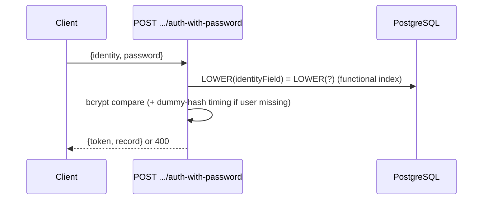
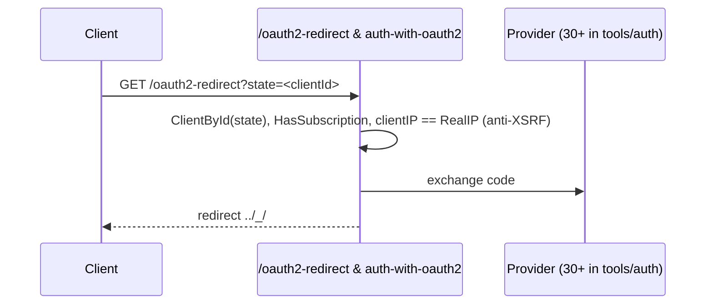

# Flows: Auth

<DocMeta audience="All" status="stable" verified="v0.5.2 (923e860)" />

All auth routes are bound in `apis/record_auth.go`. Tokens are JWT (`core/record_tokens.go`); `LoadAuthToken` middleware populates `e.Auth` (`apis/middlewares.go:43`).

## 1. Password

`apis/record_auth_with_password.go:23` returns `ForbiddenError` when `PasswordAuth.Enabled` is false. Identity lookup is the hot index-served path (see `fork-deltas.md` #2).

## 2. OAuth2 (redirect + subscription)

`apis/record_auth_with_oauth2_redirect.go:31-66,111-140`; topic `@oauth2` (`:15`); Apple name parsing `:140`. Providers: `tools/auth/` (`google,github,apple,oidc,…` + `base_provider.go`). `TrustedProxy` misconfig breaks the IP check — see `fork-deltas.md` #7.

## 3. OTP (email, 5/180s, single-use)

`POST .../request-otp` → email code (`core/otp_model.go`, cleanup `__pbOTPCleanup__ 0 * * * *` in `core/otp_model.go:124-125`). `POST .../auth-with-otp` (`apis/record_auth_with_otp.go`):

- Collection match (`:43`), expiry (`HasExpired`, `:47`), rate limit `5 req / 180s` per OTP id (`:57` → `429` at `:59`).
- Success deletes the OTP (`:73`, single-use), upgrades verified flag, sets random password when MFA is off (`:81-89`).

## 4. MFA

Checked in `apis/record_helpers.go:26,76-90,185-223` (`checkMFA/wantsMFA`, `MFA.Enabled + Rule`, `mfaId` in query/body). Advertised in `auth-methods` (`apis/record_auth_methods.go:99-114` → `mfa{enabled,duration}`). Cleanup `__pbMFACleanup__ 0 * * * *` (`core/mfa_model.go:126-127`).

## 5. Refresh (conditional renewal)

`POST .../auth-refresh` (`apis/record_auth_refresh.go:25-31`): issues `NewAuthToken()` **only if** claim `TokenClaimRefreshable` is true; otherwise reuses the presented token (e.g. impersonate tokens). This is opt-in renewal, not refresh-token rotation/invalidation.

## 6. Verification / password-reset / email-change

Symmetric request/confirm pairs, all with tests:

- `record_auth_verification_{request:45,confirm:34}.go`
- `record_auth_password_reset_{request:45,confirm:31}.go`
- `record_auth_email_change_{request:43,confirm:45}.go`

Outbound mail composed in `mails/record.go` (OTP, verification, reset, email-change, new-device auth alert `SendRecordAuthAlert`).

## 7. Impersonate (superuser-only)

`POST .../impersonate/{id}` (`apis/record_auth_impersonate.go:33-36` gate): `NewStaticAuthToken(duration)` (`:56`), duration validated against `PB_IMPERSONATE_MAX_TOKEN_DURATION` env (seconds, default `30*24*60*60` = 30 days, `:16-29,73`). Dashboard modal: `ui/src/records/recordImpersonateModal.js`.
