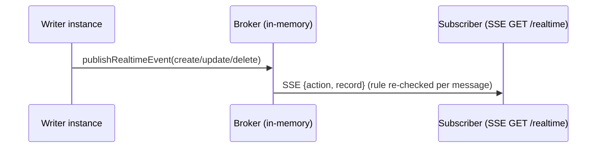
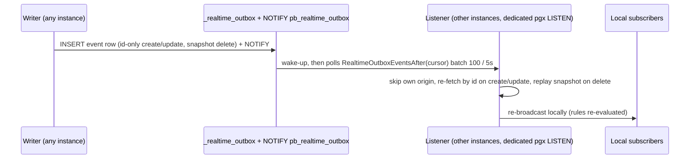

# Flows: Realtime

<DocMeta audience="All" status="stable (single-instance) / experimental (outbox)" verified="v0.5.2 (923e860)" />

## 1. Single-instance SSE (default, stable)

- Routes: `GET /api/realtime` (stream) + `POST /api/realtime` (set subscriptions), `apis/realtime.go:37-41`. Stream headers `text/event-stream/no-store`, `IdleTimeout 5m / MaxTimeout 30m` (`:65-74`).
- Fanout: `tools/subscriptions/broker.go:11-58` (`Register/Unregister`, `ChunkedClients(150)` in `apis/realtime.go:605-612`); per-client bounded queue 32, overflow counted in `pgbase_realtime_dropped_messages`.
- Access: `*` subscriptions need the collection list-rule, id subscriptions the view-rule (`docsRealtime.js`); guest→auth upgrade only mid-stream (`apis/realtime.go:223-226`); IP match enforced (`:205,215`).
- Gzip explicitly unbound for SSE (`apis/realtime.go:40`).

## 2. Cross-instance outbox (opt-in, experimental)

Enable: `PB_REALTIME_OUTBOX=1` (default off — single-instance has zero outbox reads/writes/listener). Migration DDL + pending index: `migrations/1787237104_realtime_outbox_init.go:15-26`; cursor index `migrations/1787237106_realtime_outbox_indexes.go:16-17`.

- Publisher: `core/realtime_outbox.go:65 PublishRealtimeEvent` (no-op when disabled, `:47-51`); channel `pb_realtime_outbox` (`:25-31`); table `_realtime_outbox` (`:20`); per-process `origin` (`core/base.go:100-105,227`), self-origin skipped, NULL/legacy origins always delivered.
- Payload: create/update store **only identifiers**; receiver re-fetches by id (`apis/realtime_outbox_listener.go:252-263`, skip-if-gone) so last-write-wins. Delete stores the **full sanitized snapshot** pre-commit (`apis/realtime.go:468-491`) via `sanitizeOutboxSnapshot` (`core/realtime_outbox.go:107-123`: `PublicExport` minus `password,tokenKey` for auth collections); receiver replays it (`listener.go:268-291`).
- Cursor: `RealtimeOutboxEventsAfter(afterCreated,afterId)` (`core/realtime_outbox.go:149-186`): `WHERE (created,id) > (...) AND created <= NOW() - 1s stability lag ORDER BY created,id LIMIT`, seeded to tail at registration + first LISTEN (`listener.go:61-70,131-139,228-232`).
- Listener: `OpenRealtimeOutboxListener` (`core/realtime_outbox.go:240-292`) opens a **dedicated `pgx.Connect(buildDSN)`** (derives `current_database/user` live; `app.dbConfig` captured `core/base.go:1176`) — not pooled, not multiplexable by PgBouncer transaction pooling. Poll `5s`, backoff `2s`, batch `100`.
- Retention: broadcast queue, not competing consumers — rows never ack-marked (one instance must not consume before another reads); hourly job `__pbRealtimeOutboxCleanup__ "37 * * * *"` deletes `processed_at NOT NULL OR created < now-24h` (`core/realtime_outbox.go:298-324`).
- Trust: rows trusted as much as DB writes — no inter-instance auth; a writer with DB access can forge rows (subscriber exposure stays within re-evaluated API rules). Needs hardening + load-test before default-on.
